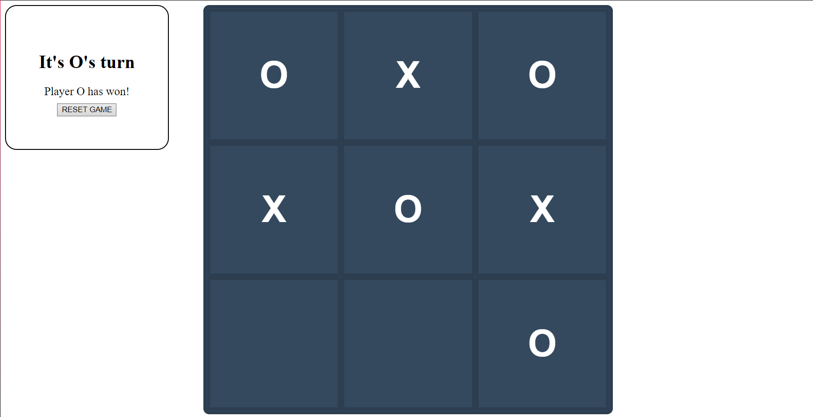

# TIC TAC TOE (Project #1)
 
Creating a Tic Tac Toe game, 
to learning the principles of JavaScript. 
Searching of new possibilities and functionality in JavaScript.

## Used Technology:
- JavaScript
- HTML
- CSS

## How to Run:
```
Only you need to run the file 'index.html' and thats it.
```

## View of the application:

